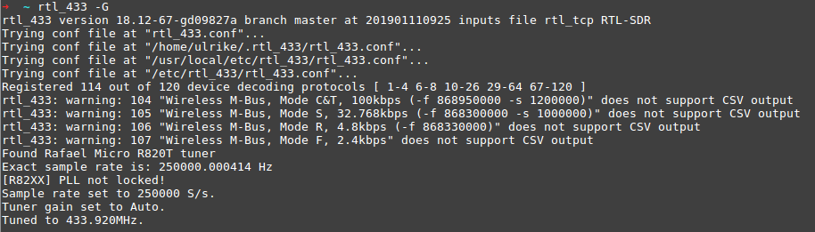
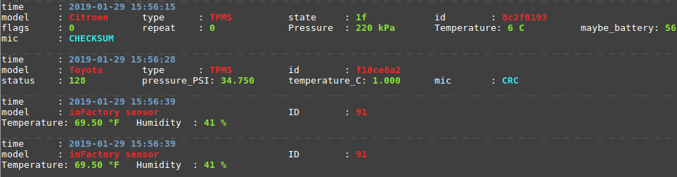
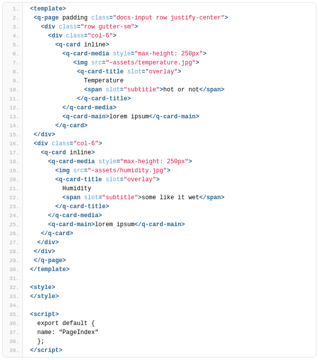
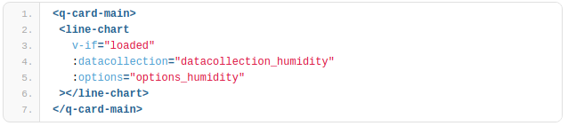

# Smart Home setup to track indoor temperatures and humidity with sensors

This project is a setup for a basic smart home web app tracking sensor data for temperature and humidity with a Raspberry Pi and web technologies like Mosquitto, Node.js, Express.js, Vue.js, Quasar and Chart.js.

# How To: Smart Home setup to track indoor temperatures and humidity with sensors, Raspberry Pi, MQTT, Node.js, Vue.js and Chart.js tutorial

TLDR; This three-part tutorial explains how to setup a basic smart home web app tracking sensor data for temperature and humidity with a Raspberry Pi and web technologies like Mosquitto, Node.js, Express.js, Vue.js, Quasar and Chart.js.

So I went on maternity this January and came up with an idea about a nice little project to do in my free time that went a little further from my usual Javascript front- und backend projects I usually do at work. I have a Raspberry Pi 3 at home I bought over a year ago and never did something useful with so I decided I wanted to track temperatures and humidity in our child's room and bedroom to a have an idea about a good indoor climate. In the end I wanted to finalize a cloud-based dashboard web app which provides the incoming sensor data in real time and available everywhere and everytime.

I wrote this three-part tutorial to track my experiences, tech choices and suggestions for you to follow and came up with a solution that comes with an easy hardware setup and some popular (and worth to learn if you are not already familiar with) web development technologies, including Node.js, Mosquitto and Vue.js.

The basic three parts will allow you to run a web application on your local machine. Nevertheless I added some more features including persistent database storing and the deployment in the cloud with Heroku. You will find these tutorials at the end of this page. The code base is stored on Github!

### Choose and install hardware (sensors, receiver, Raspberry Pi) for a basic tracking tool on temperature and humidity

I did some research on how to build basic weather stations and home automation systems with a Raspberry Pi but they were mostly no wireless solutions or they came up with too much IoT hacking/soldering and especially required a lot of electrical knowledge I do not have. The core problem I figured out was that many tutorials wanted me to build a remote sensor gagdet with radio functionality and sleep mode (e.g. with an Arduino) all on my own. So the question was: Is there a better and easier alternative to such an all self made solution and what about the receiving hardware on the Raspberry Pi?

Fortunately, there exists an easier alternative I will show you in this part of the tutorial which deals with slightly more expensive IoT gagdets but which enabled me to set up my smart home hardware in a smooth but nonetheless instructive way.

## Which (new) IoT hardware do we need for this setup?

RTL-SDR USB receiver: a cheap dongle that can be used as a computer based radio scanner for receiving live radio signals in your area (those gagdets receive signals from 500 kHz up to 1.75 GHz) (Amazon link)

Temperature / Humidity sensor: an even cheaper gagdet, that sends sensor data at 433 MHz into the area (e.g. as part of a "real" wheather station) (Amazon link)

Raspberry Pi 3 Model B: the small single-board computer servers as our heart and base station to receive and process sensor data, I have the Raspbian operating system installed. It could even serve as your web server later (if you are familiar with maintaining your own, but I will use a cloud service in this tutorial). (Amazon link)

At first, setup your sensors whereever you like in your appartment and connect your RTL-SDR receiver with the Raspberry Pi. How to receive the raw data out of the nearby area? A little open source software will help us with that: rtl_433 is a program (Github link) to decode traffic from devices that are broadcasting on 433.9 MHz. We install it on our Raspberry Pi:

sudo apt-get update
sudo apt-get upgrade
### install dependencies
sudo apt-get install libtool libusb-1.0.0-dev librtlsdr-dev rtl-sdr cmake
### clone rtl_433 Git Repository
git clone https://github.com/merbanan/rtl_433.git
### change to directory
cd rtl_433/
### make build folder
mkdir build
cd build/
### compile
cmake ../
### make
make
### install
sudo make install
### test if rtl_433 was properly installed
rtl_433 -h
sudo apt-get update
sudo apt-get upgrade
### install dependencies
sudo apt-get install libtool libusb-1.0.0-dev librtlsdr-dev rtl-sdr cmake
### clone rtl_433 Git Repository
git clone https://github.com/merbanan/rtl_433.git
### change to directory
cd rtl_433/
### make build folder
mkdir build
cd build/
### compile
cmake ../
### make
make
### install
sudo make install
### test if rtl_433 was properly installed
rtl_433 -h

After that we test if the program detects our RTL-SDR receiver with

rtl_433 -G

I had some trouble with the following error: Kernel driver is active, or device is claimed by second instance of librtlsdr. In the first case, please either detach or blacklist the kernel module (dvbusbrtl28xxu), or enable automatic detaching at compile time.

sudo rmmod dvb_usb_rtl28xxu rtl2832

in that case. If everything went well, the receiver is ready to get sensor data and rtl_433 helps with processing, so that after a few seconds you should get signals in the nearby area (yes, even temperature sensor data of your neighbor's or sensor data of connected cars.)

Hurray, hardware is running!

Proceed to the second part of the tutorial "Get and process your smart home sensor data with MQTT Broker Mosquitto and a Node.js backend".

# Get and process your smart home sensor data with MQTT Broker Mosquitto and a Node.js backend

The main problem in this part was how to set up a stable and endlessly running task on my Raspberry Pi to continuously receive the (correct!) sensor data. Secondly I wanted it to somehow process and transfer it to a backend/microservice/middleware, which then would provide an upcoming frontend with JSON data to display. MQTT is the IoT protocol to go with but how to set it up? How can a MQTT broker like Mosquitto work with a Node.js backend properly?

##Setup a web server backend with Node.js and Express.js

Multiple solutions would be possible here, but I decided for a Javascript Node.js backend which will be running with Express.js. Make sure node and npm are ready on your machine or install them first.

node -v
npm -v
Setup a project folder and a make a subfolder "server". Create a new file "server.js" within and code a basic backend service. We will upgrade its functionality later.

const express = require('express');
const app = express();
// test
app.get('/', function (req, res) {
 res.send('hello world!');
});
app.listen(3000, () => console.log('App listening on port ', 3000));

Don't forget to install the npm package_ express_ in your console and start the application! (Don't know how Node.js with Express.js works? Check out e.g. this tutorial.)

npm init
npm install express --save
node server.js
Go to your browser and check if your web server works on http://localhost:3000.

## Setup the MQTT broker Mosquitto

Why MQTT? The protocol is a lightweight publish/subscribe messaging transport solution which is very popular in the IoT field. We will use a MQTT broker as the control center to receive raw sensor data from our rtl_433 program, we installed in the previous chapter and forward them to our web server. Mosquitto is a common MQTT broker and is installed and tested on or Raspberry Pi with

sudo apt install -y mosquitto mosquitto-clients

mosquitto -v

The broker will be accessable to clients on mqtt://localhost:1883.

##Setup a bash script that pipes incoming data to Mosquitto

The Raspberry Pi now gets the important task to not only start rtl_433 to decode traffic from devices that are broadcasting on 433.9 MHz manually, but to start this task on every reboot automatically. For that, we create a cronjob with the tool crontab, which should be installed on our system.

crontab -h

On your Raspberry Pi create a new file tshraspberryscript.sh (or whatever you want) in your pi home folder and make it executable from your terminal:

chmod +x tsh_raspberry_script.sh

After that, open the file in a text editor and add the following bash script. It will start rtl_433 and pipe the output in JSON format to Mosquitto, where it will be published in the topic home/rtl_344. Don't forget to close and safe the file.

### !bin/bash

/usr/local/bin/rtl_433 -F json -M utc ' mosquitto_pub -t home/rtl_433 -l
Now we can set up a new cronjob which will execute the shell script on every Raspberry Pi reboot. Open up a terminal:

### edit crontabs of user "pi"
crontab -e
### a text editor will open and load all existing cronjobs, add
@reboot sleep 60 && sh /home/pi/tsh_raspberry_script.sh

# Build a simple database with lowdb and Node.js

In development mode a very basic database will suffice our requirements, that's why I used lowdb (Github link) to store the sensor data on localhost first. Lowdb is based on a JSON file in our project folder. If you would like to take an eye on performance and persistence later I have built a solution with PostgreSQL too, but this is another story.

npm install lowdb --save

In your server.js add some code. Set some defaults first, which are required if your JSON file (mine is "db.json") is empty at first.

Editavle Code : 
const mqtt = require('mqtt');
const client = mqtt.connect(mqtt://localhost:1883);
fahrenheitToCelsius = (fahrenheit) => {
 var fTempVal = parseFloat(fahrenheit);
 var cTempVal = (fTempVal - 32) * (5 / 9);
 return (Math.round(cTempVal * 100) / 100);
}
client.on('message', function (topic, message) {
 // message is buffer
 var stringBuf = message && message.toString('utf-8')
 try {
   var json = JSON.parse(stringBuf);
   // console.log(json);
   if (json.model === 'inFactory sensor') {
     if (json.id === 91 '' json.id === 32) {
     // catch my specific sensor model
       if (json.temperature_F && json.humidity) {
       // add data to lowdb
       const time = moment.utc(json.time).tz("Europe/Berlin");
       const formattedTime = time.format('YYYY-MM-DD HH:mm:ss');
       console.log('write post');
       db.get('posts')
       .push({ id: uuid.v1(), room: json.id, temp: 
            fahrenheitToCelsius(json.temperature_F), 
            humidity: json.humidity, time: formattedTime }).write()
       }
     }
   }
 } catch (e) {
   console.error(stringBuf);
   }
})

That's it. Whenever the MQTT client receives sensor data it will store it in our database accordingly. You can check that in your "db.json" file in your project folder, which grows bigger and bigger during runtime. It won't delete itself on backend restart!

Editable Code : 
{
"posts": [
{
"id": "c107fc70-1f33-11e9-9b95-fbfea27c8046",
"room": 32,
"temp": 22.89,
"humidity": 30,
"time": "2019-01-23 18:24:34"
},
{
"id": "6607f9f0-1f34-11e9-9b95-fbfea27c8046",
"room": 32,
"temp": 22.89,
"humidity": 30,
"time": "2019-01-23 18:29:11"
},
{
"id": "16492190-1f35-11e9-9b95-fbfea27c8046",
"room": 91,
"temp": 22.72,
"humidity": 35,
"time": "2019-01-23 18:34:07"
}
]
}

# Provide sensor data via REST API

Now that we have clean data in our lowdb we might want to provide them via a REST API to be consumable for a frontend or multiple frontends (smartphone app, web app, ..). We already deployed a local web server running on Node.js and Express.js and can very simply add an endpoint the provides the database data with the following code. Add it to your server.js!

app.get('/api', (req, res) => {
 res.send(db.get('posts'));
});

Yes, that's it. Check if it is working on http://localhost:3000/api or with your favourite REST client (e.g. Postman).

# Display smart home data in a Quasar, Vue.js and Chart.js powered web application
In this part we will build a basic dashboard displaying smart home sensor data with charts. We could go with whatever implementation you would like here: from vanilla HTML/CSS/JS to every framework which is suitable to our needs - which are basically doing an API call to our backend to fetch sensor data and lift them up to work nicely with a chart visualisation.  There are also other good solutions to deal with IoT frontends like Pimatic, OpenHAB and FHEM, but let's just build this part completely on our own. We will go with the SPA framework Vue.js with Quasar on top: It comes with UI components in the popular Material Design, axios and some other features, that help getting started with Vue.js very fast.

## Install dependencies

Install the Vue.js (Link) and Quasar CLI (Github link) first!

npm install -g vue-cli
npm install -g quasar-cli

Go to your project root and init a new sub project for your frontend code with

quasar init vue-frontend

Now start you development server on http://localhost:8080/ with

quasar dev

and you are ready to develop your frontend according to your likes. Quasar comes with a basic starter layout including a side navigation. However we don't need to work on this heavily and focus on the homepage, where we will build the dashboard functionality.

Go to Index.vue and update the basic dashboard layout. You can use static images like in my proposal and put them into the src/assets folder.

# Fetch sensor data from Node.js backend

To fetch necessary data on initial page load we make use of Vue.js' created() function in the scripts section below the template. We insert a new function this.fetchData(); there and implement this new function in the methods' block.

Editable Code: 
methods: {
  fetchData() {
   this.loaded = false;
   this.$axios
    .get("http://localhost:3000/api")
    .then(response => {
       return response.data;
    })
    .then(response => {
      console.log(response);
      this.loaded = true;
    })
    .catch(e => {
      console.log(e);
      this.$q.notify({
       color: "negative",
       position: "top",
       message: "Could not fetch.",
       icon: "report_problem"
    });
  });
 }
}

We simply use the axios library (Github link) which Quasar included right from the setup, so we can use it globally without importing it explicitly. If this works properly you should be able to log the array of sensor data in your browser's developer tools. If there is any problem, we trigger the Quasar component notification and include the error message.

Hint: If you encounter CORS problems in the communication between front- and backend (e. g. "No Access-Control-Allow-Origin header is present on the requested resource.") edit your server.js and restart it as follows:

Editable Code: 
app.use(function (req, res, next) {
 res.header("Access-Control-Allow-Origin", "*");
 res.header("Access-Control-Allow-Headers", 
    "Origin, X-Requested-With, Content-Type, Accept");
 next();
});

# Build a line chart with Chart.js

In this part I will focus on displaying only the temperature chart to make the tutorial more comprehensable. At first we will install the npm package vue-chartjs (Github link) which works as a practical Vue.js wrapper for Chart.js (Link).

npm install vue-chartsjs --save

Now we build a generic, reusable line chart component to use in the web application. Create a new file "LineChart.js" in the src/components folder and import the vue-chartsjs package. Furthermore, we will follow the basic tutorial for the package and specify a data collection prop and an options prop that will prettify our line chart later.

Editable Code : 
import { Line } from 'vue-chartjs';
export default {
 extends: Line,
 props: {
   datacollection: {
    type: Object,
    default: null
   },
   options: {
    type: Object,
    default: null
   }
  },
 mounted() {
   this.renderChart(this.datacollection, this.options, {responsive: true})
 }
}

We also have to edit our fetchData(); function and transfer the fetched data as a processible JSON to the data collection prop.

Editable Code : // process the backend response and add labels and some styling for the Chart.js api  
const datacollection_humidity = {
   labels: response.map(obj => obj.time),
   datasets: [
     {
       label: "Humidity",
       backgroundColor: "#000",
       data: response.map(obj => obj.humidity)
     }
   ]
};
this.datacollection_humidity = datacollection_humidity;
// set some optional properties regarding axes and ticks
this.options_humidity = {
   scales: {
   xAxes: [
     {
       type: "time",
       distribution: "linear"
     }
   ],
   yAxes: [
     {
       scaleLabel: {
       display: true
     },
   ticks: {
     callback: function(value, index, values) {
       return value + "%";
       }
     }
    }
   ]
  }
};

Don't forget to add the LineChart component and the necessary "loaded" data prop in your Vue.js script section.

Switch to the Index.vue again and include a new line chart component (html tag) in your template. We want to display it within the card component. Additionally we specify some properties: v-if="loaded" will tell the component that it should only mount, if the according data prop is true. Also, we transfer the fetched datacollection_humidity and options_humidity as our generic datacollection and options into the line chart.

Editable Code :
export default {
 name: "PageIndex",
 components: {
   LineChart
   },
 data() {
   return {
     loaded: false,
     };
   }
}

That's it! On every page reload, the web application fetches available sensor data from our backend service and will display it as a line chart. You would like to add more functionality? You can find all features we built and more (filtering, reloading, deploying, saving persistently, ..) in my Github repository for this project.

# Add more features?

I wrote some more or less standalone tutorials, which will help you to improve your existent application with some more capacities.

Setup PostgreSQL database and API for Node.js
Get a CSV download out of PostgreSQL or lowdb database on Node.js

### Start the Node.js backend on port 3000
* cd server
* npm install
* node server.js

### Start the Vue.js development frontend on port 8080
* cd vue-frontend
* npm install
* quasar dev
