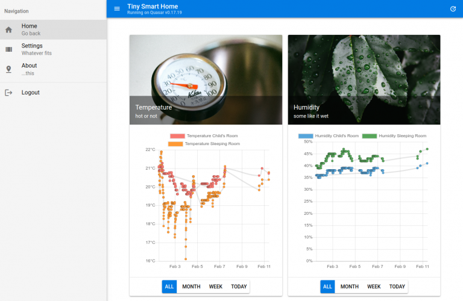

# Smart Home setup to track indoor temperatures and humidity with sensors

This project is a setup for a basic smart home web app tracking sensor data for temperature and humidity with a Raspberry Pi and web technologies like Mosquitto, Node.js, Express.js, Vue.js, Quasar and Chart.js.

Smart Home setup to track indoor temperatures and humidity with sensors, Raspberry Pi, MQTT, Node.js, Vue.js and Chart.js

TLDR; This three-part tutorial explains how to setup a basic smart home web app tracking sensor data for temperature and humidity with a Raspberry Pi and web technologies like Mosquitto, Node.js, Express.js, Vue.js, Quasar and Chart.js.

So I went on maternity this January and came up with an idea about a nice little project to do in my free time that went a little further from my usual Javascript front- und backend projects I usually do at work. I have a Raspberry Pi 3 at home I bought over a year ago and never did something useful with so I decided I wanted to track temperatures and humidity in our child's room and bedroom to a have an idea about a good indoor climate. In the end I wanted to finalize a cloud-based dashboard web app which provides the incoming sensor data in real time and available everywhere and everytime.

I wrote this three-part tutorial to track my experiences, tech choices and suggestions for you to follow and came up with a solution that comes with an easy hardware setup and some popular (and worth to learn if you are not already familiar with) web development technologies, including Node.js, Mosquitto and Vue.js.

The basic three parts will allow you to run a web application on your local machine. Nevertheless I added some more features including persistent database storing and the deployment in the cloud with Heroku. You will find these tutorials at the end of this page. The code base is stored on Github!

### Choose and install hardware (sensors, receiver, Raspberry Pi) for a basic tracking tool on temperature and humidity

I did some research on how to build basic weather stations and home automation systems with a Raspberry Pi but they were mostly no wireless solutions or they came up with too much IoT hacking/soldering and especially required a lot of electrical knowledge I do not have. The core problem I figured out was that many tutorials wanted me to build a remote sensor gagdet with radio functionality and sleep mode (e.g. with an Arduino) all on my own. So the question was: Is there a better and easier alternative to such an all self made solution and what about the receiving hardware on the Raspberry Pi?

Fortunately, there exists an easier alternative I will show you in this part of the tutorial which deals with slightly more expensive IoT gagdets but which enabled me to set up my smart home hardware in a smooth but nonetheless instructive way.

## Which (new) IoT hardware do we need for this setup?

RTL-SDR USB receiver: a cheap dongle that can be used as a computer based radio scanner for receiving live radio signals in your area (those gagdets receive signals from 500 kHz up to 1.75 GHz) (Amazon link)

Temperature / Humidity sensor: an even cheaper gagdet, that sends sensor data at 433 MHz into the area (e.g. as part of a "real" wheather station) (Amazon link)

Raspberry Pi 3 Model B: the small single-board computer servers as our heart and base station to receive and process sensor data, I have the Raspbian operating system installed. It could even serve as your web server later (if you are familiar with maintaining your own, but I will use a cloud service in this tutorial). (Amazon link)

At first, setup your sensors whereever you like in your appartment and connect your RTL-SDR receiver with the Raspberry Pi. How to receive the raw data out of the nearby area? A little open source software will help us with that: rtl_433 is a program (Github link) to decode traffic from devices that are broadcasting on 433.9 MHz. We install it on our Raspberry Pi:

sudo apt-get update
sudo apt-get upgrade
### install dependencies
sudo apt-get install libtool libusb-1.0.0-dev librtlsdr-dev rtl-sdr cmake
### clone rtl_433 Git Repository
git clone https://github.com/merbanan/rtl_433.git
# change to directory
cd rtl_433/
# make build folder
mkdir build
cd build/
# compile
cmake ../
# make
make
# install
sudo make install
# test if rtl_433 was properly installed
rtl_433 -h
sudo apt-get update
sudo apt-get upgrade
# install dependencies
sudo apt-get install libtool libusb-1.0.0-dev librtlsdr-dev rtl-sdr cmake
# clone rtl_433 Git Repository
git clone https://github.com/merbanan/rtl_433.git
# change to directory
cd rtl_433/
# make build folder
mkdir build
cd build/
# compile
cmake ../
# make
make
# install
sudo make install
# test if rtl_433 was properly installed
rtl_433 -h
After that we test if the program detects our RTL-SDR receiver with

rtl_433 -G
I had some trouble with the following error: Kernel driver is active, or device is claimed by second instance of librtlsdr. In the first case, please either detach or blacklist the kernel module (dvbusbrtl28xxu), or enable automatic detaching at compile time.

The repository owner recommends

sudo rmmod dvb_usb_rtl28xxu rtl2832
in that case. If everything went well, the receiver is ready to get sensor data and rtl_433 helps with processing, so that after a few seconds you should get signals in the nearby area (yes, even temperature sensor data of your neighbor's or sensor data of connected cars.)

Incoming Messages

Incoming Messages (2)

Hurray, hardware is running!

Proceed to the second part of the tutorial "Get and process your smart home sensor data with MQTT Broker Mosquitto and a Node.js backend".

### Start the Node.js backend on port 3000
* cd server
* npm install
* node server.js

### Start the Vue.js development frontend on port 8080
* cd vue-frontend
* npm install
* quasar dev
